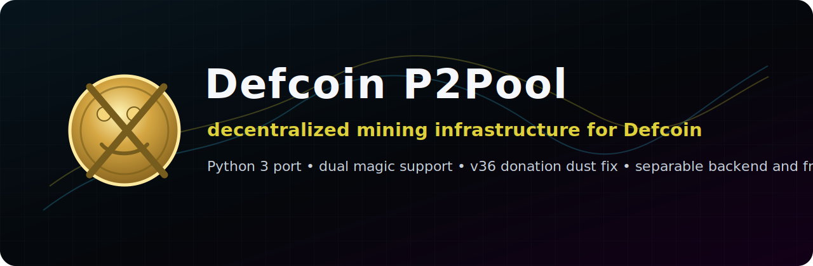
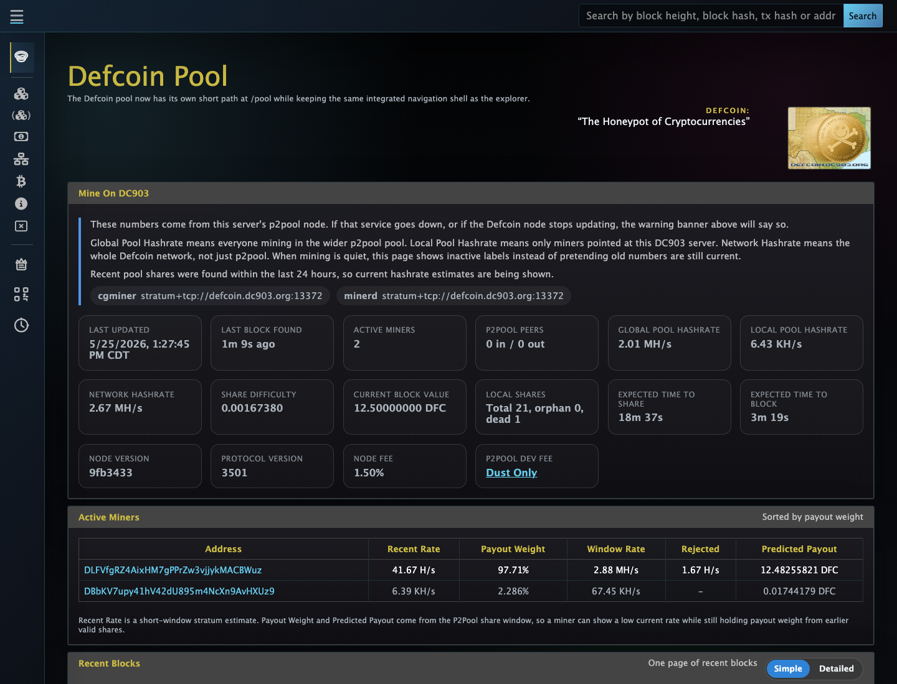
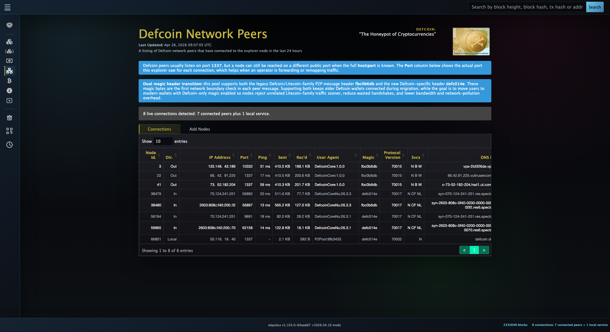

<p align="center">
  
</p>

# Defcoin P2Pool

Defcoin P2Pool is decentralized pool infrastructure for mining Defcoin without
routing all share accounting through one central pool database. It keeps the
classic P2Pool sharechain model, updates the runtime to Python 3, and adds the
Defcoin-specific network fixes needed by current wallets and pool operators.

Run a pool node. Point miners at Stratum. Keep Defcoin mining cooperative.

For the recommended modern Defcoin full-node wallet, use
[Defcoin Core Nu](https://github.com/defcoincore/Defcoin-Core-Nu).

## What changed

- Python 3 runtime support with current dependency audits.
- Defcoin dual-magic parent-chain compatibility: legacy `fbc0b6db` and new
  Defcoin `defc014e`, with per-peer reply magic.
- `/Defcoin` User-Agent filtering for legacy-magic parent-chain peer address
  gossip.
- Defcoin P2Pool share version `36`, which removes the old lost-key P2Pool
  developer donation dust output from new share templates.
- Bounded caches for repeated target, difficulty, script, and address
  conversions used by the pool API and explorer-style display paths.
- A cleaner backend/frontend layout so operators can run the backend with the
  bundled web UI or point it at a custom frontend.

## Screenshots

<p align="center">
  
</p>

<p align="center">
  
</p>

## Repository layout

- `backend/` - Python P2Pool backend, Defcoin network rules, tests, and helper
  scripts.
- `frontend/` - bundled web UI assets and reference frontend material.
- `docs/TECHNICAL_GUIDE.md` - the single public technical guide for this fork.
- `run_p2pool.py` - compatibility launcher that keeps the historical root
  command working while loading `backend/run_p2pool.py`.

## Quick start

Run this pool next to a fully synced `defcoind` or Defcoin Core Nu backend.

```bash
python3 -m venv .venv
. .venv/bin/activate
python -m pip install --upgrade pip
python -m pip install -r backend/requirements.txt
python -m pip install -e backend/litecoin_scrypt
```

Start a public Defcoin P2Pool node:

```bash
DEFCOIN_P2POOL_USE_NEW_MAGIC=1 \
python run_p2pool.py \
  --net defcoin \
  --allow-obsolete-bitcoind \
  -a YOUR_DEFCOIN_OPERATOR_ADDRESS \
  -n YOUR_PUBLIC_IP \
  --bitcoind-address 127.0.0.1 \
  --bitcoind-p2p-port 10332 \
  --fee 1.5
```

UPnP is disabled by default in this Defcoin fork. Use `--enable-upnp` only for
consumer NAT deployments where automatic router port mapping is explicitly
desired.

Point miners at the configured Stratum worker port, commonly:

```text
stratum+tcp://YOUR_POOL_HOST:13372
```

Use the miner payout address as the Stratum username and any password.

## Frontend options

The backend serves `frontend/web-static` by default. To run a custom frontend,
start the backend with:

```bash
python run_p2pool.py --net defcoin --web-static /path/to/custom/web-static ...
```

See [frontend/README.md](frontend/README.md) for the frontend boundary and
[backend/README.md](backend/README.md) for backend setup and test commands.

## Technical guide

For architecture, lineage, security notes, dependency policy, dual-magic
behavior, User-Agent filtering, share version `36`, performance cache evidence,
and operational details, read
[docs/TECHNICAL_GUIDE.md](docs/TECHNICAL_GUIDE.md).

## License

This repository follows the inherited P2Pool license: GNU General Public
License version 3. See [COPYING](COPYING).
